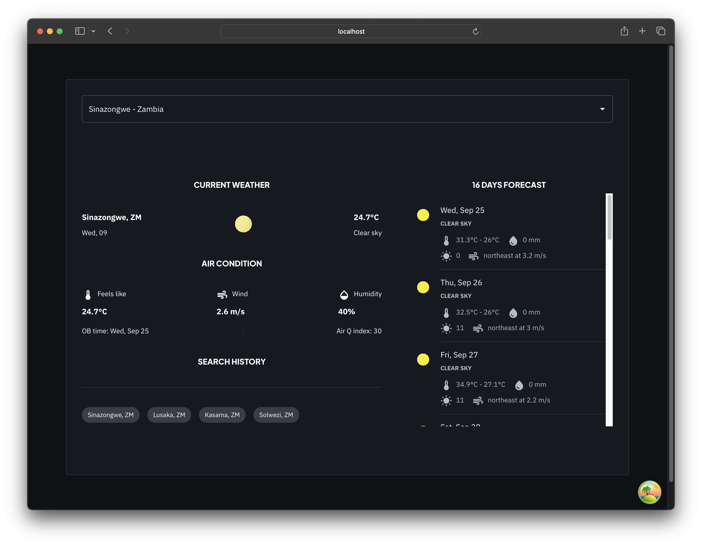
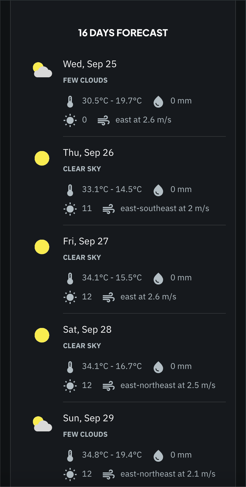
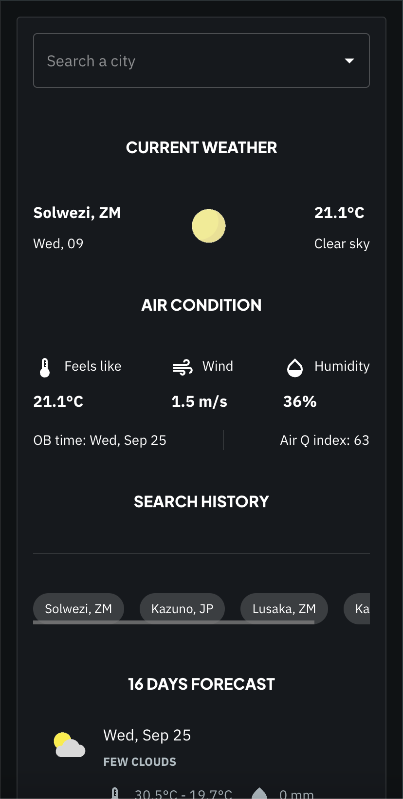

## Application Screenshots

### Desktop View

*This view displays the application on a desktop screen, showcasing the main interface with weather data and forecasts.*

---

### Mobile View - Current Weather

*This view focuses on the current day's weather information, including temperature, humidity, wind speed, and more, optimized for mobile devices.*

---

### Mobile View - 16-Day Weather Forecast

*This screen provides a detailed 16-day weather forecast, displayed in a user-friendly format, ideal for quick glances on mobile devices.*

# Weather Application

This application consists of a backend service written in Node.js and Express, and a frontend built with React and Next.js. The application allows users to fetch and display weather information, with support for offline functionality.

## Table of Contents

1. [Backend Setup](#backend-setup)
2. [Frontend Setup](#frontend-setup)
3. [Tech Stack](#tech-stack)

## Backend Setup

The backend is a Node.js Express application located in the `backend` folder. To set up and run the backend server, follow these steps:

1. **Environment Variables:**

   Create a `.env` file in the `backend` folder and populate it with the following variables:

   ```
   SERVER_PORT=5050
   BASE_URL=https://api.weatherbit.io/v2.0/
   WEATHERBIT_API_KEY=955d2bc95a054edaaa02de0488411043
   ```

   You can use the provided values for testing purposes.

2. **Install Dependencies:**

   Navigate to the `backend` directory in your terminal and run:

   ```bash
   yarn install
   ```

3. **Start the Backend Server:**

   After installing dependencies, start the server using:

   ```bash
   yarn start
   ```

4. **Expected Output:**

   If everything is set up correctly, you should see the following message in the console:

   ```
   Server is running on port 5050
   ```

## Frontend Setup

The frontend is a React application built with Next.js, Material UI, React Query, Zustand, and React Hook Form. It is located in the `frontend` folder in the root directory.

1. **Environment Variables:**

   Create a `.env` file in the `frontend` folder and populate it with the following variables:

   ```
   NEXT_PUBLIC_API_URI=http://localhost:5050/weather
   NEXT_PUBLIC_API_PROXY_URI=http://localhost:3000
   NEXT_PUBLIC_X_RAPID_API_KEY=8565416c22msh93775c949c2c84dp1596f0jsn11d462823f94
   NEXT_PUBLIC_X_RAPID_API_HOST=wft-geo-db.p.rapidapi.com
   ```

   You can use the provided values for testing purposes.

2. **Install Dependencies:**

   Navigate to the `frontend` directory in your terminal and run:

   ```bash
   yarn install
   ```

3. **Build the Frontend:**

   Build the application for the first time by running:

   ```bash
   yarn build
   ```

4. **Start the Frontend Server:**

   Start the development server using:

   ```bash
   yarn dev
   ```

5. **Accessing the Application:**

   Open your browser and go to [http://localhost:3000](http://localhost:3000) to access the frontend of the application.

## Tech Stack

### Backend
- **Node.js & Express:** Server-side framework for building the backend API.
- **Weatherbit API:** Used to fetch weather data.

### Frontend
1. **React & Next.js:** A powerful and efficient React framework for building the frontend.
2. **Material-UI (MUI):** A beautiful component library based on Material Design principles.
3. **React Query:** A server-side state management library that supports offline functionality.
4. **Zustand:** A lightweight state management library for client-side state with offline support.
5. **React Hook Form:** A powerful form management library for handling forms with ease.

### Features
- **Offline Functionality:**
  - The application caches weather search results, enabling offline usage.
  - Using a combination of React Query, Zustand, and Next.js, the app can refresh data intelligently without user intervention.

### Notes
- Ensure that both the frontend and backend servers are running simultaneously to enable full functionality of the application.
- For production, make sure to replace the provided API keys and URIs with your own credentials.

### Contributions
Feel free to contribute to this project by submitting issues or pull requests. We welcome contributions that help improve the application!

### License
This project is licensed under the MIT License. See the LICENSE file for details.
